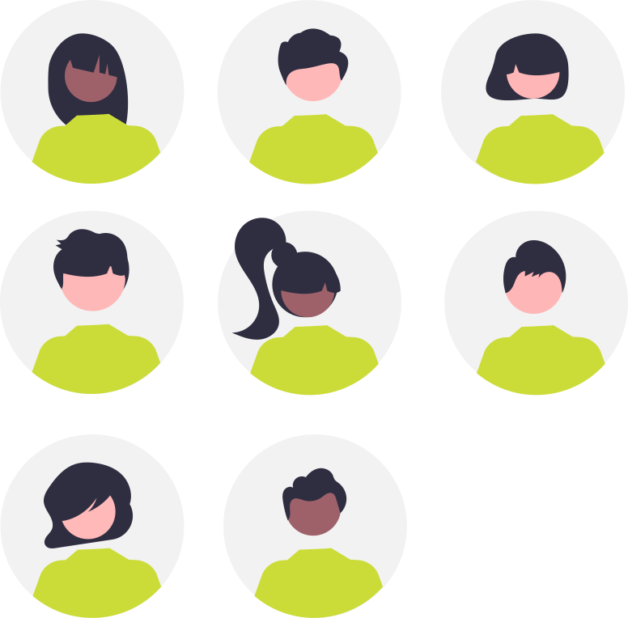
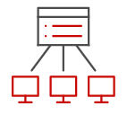
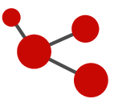
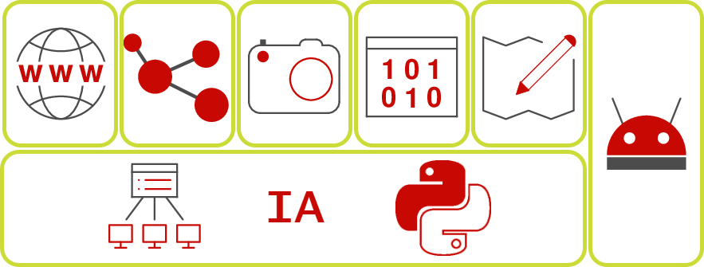

[{: align=left width=10%}](){target=_blank}[{: align=right width=10%}](mailto:team@ecmorlaix.fr){target=_blank}Ce site s'adresse aux secondes 2GT4 du lycée Notre Dame du Mur de MORLAIX pour l'enseignement des Sciences Numériques et Technologie.

{: .center width=40%}

<!-- 
### Autres liens du groupe :

- [Sharepoint](){target=_blank}
- [Conversation](){target=_blank} -->

## Programme

??? abstract "Le [programme](https://eduscol.education.fr/1670/programmes-et-ressources-en-sciences-numeriques-et-technologie-voie-gt){target=_blank} de SNT est articulé autour de sept thèmes:"

    === "Données structurées"
        {align=left}
        
        Les données constituent la matière première de toute activité numérique. Afin de permettre leur réutilisation, il est nécessaire de les conserver de manière persistante. Les structurer correctement garantit que l’on puisse les exploiter facilement pour produire de l’information.

        Comment traiter ces données ?
    === "Photo numérique"

        {align=left}
        
        Les technologies de la photographie argentique ont eu une évolution très lente, liée aux progrès en optique, mécanique et chimie. Ce n’est plus du tout le cas de l’évolution actuelle, davantage due aux algorithmes qu’à la physique : algorithmes de développement et d’amélioration de l’image brute, algorithmes d’aide à la prise de vue. La photographie numérique présente un coût marginal très faible et une diffusion par internet facile et immédiate : chaque jour, des milliards de photos sont prises et partagées.

        Comment sont représentées ces images sur un ordinateur et comment les traiter pour les modifier ?

    === "Internet"
        {align=left}

        Grâce à sa souplesse et à son universalité, Internet est devenu le moyen de communication principal entre les hommes et avec les machines.

        Quels sont les techniques et protocoles qui permettent la circulation des informations sur ce réseau mondial ?
    === "Web"
        {align=left}

        Le Web (toile) désigne un système donnant accès à un ensemble de données (page, image, son, vidéo) reliées par des liens hypertextes et accessibles sur le réseau Internet.

        Comment sont construites les pages Web et comment communiquer avec un serveur ?

    === "Réseaux sociaux"
        {align=left}

        Les réseaux sociaux sont des applications basées sur les technologies du Web qui offrent un service de mise en relation d’internautes pour ainsi développer des communautés d’intérêts.

        Comment ces réseaux gèrent les données des utilisateurs et comment mettent-ils en place les services de recommandation/suggestion ?
    === "Localisation /cartographie"
        {align=left}

        La cartographie est essentielle pour beaucoup d’activités : agriculture, urbanisme, transports, loisirs, etc. Elle a été révolutionnée par l’arrivée des cartes numériques accessibles depuis les ordinateurs, tablettes et téléphones, bien plus souples à l’usage que les cartes papier.

        Comment se repérer sur ces cartes et comment calculer un itinéraire ?

    === "Objets connectés"
        {align=left}
        Embarquer l’informatique dans les objets a beaucoup d’avantages : simplifier leur fonctionnement, leur donner plus de possibilités d’usage et de sûreté, et leur permettre d’intégrer de nouvelles possibilités à matériel constant par simple modification de leur logiciel.

        Comment réaliser un programme simple à embarquer dans un objet ?

??? tip "Progression envisagée :"

    {.center}

    - Le thème de l'informatique embarquée et des objets connectés (IOT : internet of things) étant également abordé au cours de l'année par certains en enseignement de Sciences de l'Ingénieur, ils nous en présenteront une synthèse à la fin.

    - L'initiation à la programmation en Python, l'Internet, ainsi que l'IA, seront traités transversalement aux autres thèmes au fil de l'eau.

??? warning "Evolution de l’enseignement SNT :"

    Nous tâcherons de suivre la première recommandation d'évolution de l’enseignement SNT publiée en juin 2022 par le Conseil Supérieur des Programmes (CSP) et soutenue par la Société Informatique de France (SIF) qui consiste à faire évoluer le contenu de cet enseignement de seconde **vers un enseignement d’informatique et numérique en lien direct avec les besoins de formation du citoyen et du scientifique du XXIe siècle**.

    > _"En effet, cet enseignement se doit de répondre à plusieurs enjeux essentiels et complémentaires : donner un socle de connaissances et compétences fondamentales nécessaire à tout citoyen du XXIe siècle, contribuer à construire le bagage des informaticiens en devenir, transmettre aux jeunes des premières clés scientifiques et techniques pour être en capacité d’inventer les futurs usages du numérique dans les nombreuses disciplines et métiers qu’il transforme, et enfin les éclairer dans leurs choix d’orientation."_
    >
    > _"En particulier, cet enseignement devrait être l’occasion de montrer l’informatique dans sa diversité en transmettant des éléments essentiels issus des 4 piliers de cette science et technique : algorithmes, langages, données, machines. Le recours à des thèmes concrets proches des usages des jeunes pour illustrer les différents concepts mérite d’être conservé à condition d’être, cette fois, assujetti à de réelles ambitions en matière d’acquisition de compétences et connaissances fondamentales en informatique."_ (extraits du [COMMUNIQUE DE LA SIF POUR UNE EVOLUTION DE L'ENSEIGNEMENT SNT](https://www.societe-informatique-de-france.fr/wp-content/uploads/2022/07/Communique_SIF_sur_SNT.pdf){target=_blank})
    
    {.center}

    > Je tâcherai donc de vous accompagner, autant que possible, dans votre apprentissage de **l'informatique, la "vrai"** !

## Cahier de texte

***

{: .center width=50%}

[mail]: mailto:eric.madec@ecmorlaix.fr "eric.madec@ecmorlaix.fr"
[notebook jupyter]: https://ericecmorlaix.github.io/adn-Tutoriel_lab_si/IDE/notebook/

***
<!-- 
???+ question "Questions ouvertes : ..."

    - Est-ce que apprendre Python c'est utile si on n'a pas l'intention de faire NSI ou SI ?

- Ce sera évalué en SNT ;
- Python est le langage retenu dans toutes les spécialités scientifiques au lycée ;
- Culture pour mieux comprendre le fonctionement des algorithmes, des scripts exécutés par les machines...
- <https://duckduckgo.com/?q=python+en+médecine&atb=v433-1&ia=web>

 -->

<!-- 
**A LIRE :**

- [Travailler PYTHON en prépa ECG](https://www.prepaplus.tv/blog/50/Travailler-python-en-prepa-ECG){target=_blank}, [LA LICENCE MIASHS
Mathématiques et informatiques appliquées aux sciences humaines et sociales](https://www.onisep.fr/Choisir-mes-etudes/apres-le-bac/principaux-domaines-d-etudes/les-licences-de-sciences/la-licence-miashs){target=_blank} ;

- [ChatGPT : « Non, le métier de développeur informatique n’est pas mort ! ](https://www.nouvelobs.com/opinions/20230321.OBS71149/chatgpt-non-le-metier-de-developpeur-informatique-n-est-pas-mort.html){target=_blank}

 - [Sortir de sa zone de confort pour apprendre afin de se réaliser](https://static.wixstatic.com/media/557f79_7cbdd28074e84e4882ec9314f46d5fb0~mv2.jpeg/v1/fill/w_1024,h_768,al_c,q_90/557f79_7cbdd28074e84e4882ec9314f46d5fb0~mv2.webp){target=_blank} ;
     source : <https://www.jeromefrugere.com/post/pourquoi-dit-on-qu-il-faut-se-faire-violence-pour-sortir-de-sa-zone-de-confort>

***
## Le 06/06

=== "CONTENU DE SÉANCE"

    - [ChatGPT ? Voulez-vous comprendre ce que c’est ?](https://www.lemonde.fr/blog/binaire/2023/05/12/chatgpt-voulez-vous-comprendre-ce-que-cest/){target=_blank} 

    - **Finir** tous les niveaux de [Pyrates](https://py-rates.fr/){target=_blank}
    

=== "TRAVAIL À FAIRE"

    - ==**Bonnes vavances...**==   

***
## Le 30/05

=== "CONTENU DE SÉANCE"

    - **Découvrir** l'[Intelligence Artificielle avec vittascience](https://fr.vittascience.com/ia/){target=_blank} : [**entrainer** une machine à reconnaitre des images](https://fr.vittascience.com/ia/images.php?mode=mixed){target=_blank}    
    
    

    <figure><iframe width="560" height="315" src="https://www.youtube-nocookie.com/embed/EDtvcOl_PhA" title="YouTube video player" frameborder="0" allow="accelerometer; autoplay; clipboard-write; encrypted-media; gyroscope; picture-in-picture; web-share" allowfullscreen></iframe>
    <figcation>Tutoriel Entraînement IA</figcation>
    </figure>
    

=== "TRAVAIL À FAIRE"

    - **Poursuivre** les activités de découverte concernant [la photographie numérique](https://parcours.algorea.org/contents/4707-4702-1067253748629066205-1625996270397195025-1089626022569595539/){target=_blank}
   

***
## Le 09/05

=== "CONTENU DE SÉANCE"

    - Evaluation par QCM sur les [expériences de traitement de données](./DS/#experiences-de-traitement) ;
    - **Poursuivre** les activités de découverte concernant [la photographie numérique](https://parcours.algorea.org/contents/4707-4702-1067253748629066205-1625996270397195025-1089626022569595539/){target=_blank}  

=== "TRAVAIL À FAIRE"

    - **Poursuivre** les activités de découverte concernant [la photographie numérique](https://parcours.algorea.org/contents/4707-4702-1067253748629066205-1625996270397195025-1089626022569595539/){target=_blank}
   

***
## Le 02/05

=== "CONTENU DE SÉANCE"

    - **Fin des interrogations orales** sur les [expériences de traitement de données](./DS/#experiences-de-traitement) ;
    - **Mesurer** vos compétences dans le domaine des données structurées en suivant [le parcours `XXMJHZ354` sur PIX](https://app.pix.fr/campagnes/XXMJHZ354){target="_blank"} ;
    - **Commencer** les activités de découverte concernant [la photographie numérique](https://parcours.algorea.org/contents/4707-4702-1067253748629066205-1625996270397195025-1089626022569595539/){target=_blank}  

=== "TRAVAIL À FAIRE"

    - **Se préparer** pour une évaluation par QCM sur les [expériences de traitement de données](./DS/#experiences-de-traitement) ;
   

***
## Le 11/04

=== "CONTENU DE SÉANCE"

    - Intervention en visio d'une étudiante en école de commerce pour présenter sa pratique de la programmation Python pour réaliser des requètes dans des tables de données ;
    - **Interrogations orales** sur la troisième partie des [expériences de traitement de données](./DS/#experiences-de-traitement) ;
    - **Mesurer** vos compétences dans le domaine des données structurées en suivant [le parcours `XXMJHZ354` sur PIX](https://app.pix.fr/campagnes/XXMJHZ354){target="_blank"} ;  

=== "TRAVAIL À FAIRE"

    - **Finir** les [expériences de traitement de données](./DS/#experiences-de-traitement) ;
    - **Faire** la [mise à jour d'Obsidian pour découvrir les canvas](https://ericecmorlaix.github.io/adn-Tutoriel_Obsidian/7-Options_Plugins/#canvas){target=_blank} ;

***
## Le 04/04

=== "CONTENU DE SÉANCE"

    - **Interrogations orales** sur la première partie des [expériences de traitement de données](./DS/#experiences-de-traitement) ;
    - **Mesurer** vos compétences dans le domaine des données structurées en suivant [le parcours `XXMJHZ354` sur PIX](https://app.pix.fr/campagnes/XXMJHZ354){target="_blank"} ;  

=== "TRAVAIL À FAIRE"

    - **Finir** les [expériences de traitement de données](./DS/#experiences-de-traitement) ;
    - **Faire** la [mise à jour d'Obsidian pour découvrir les canvas](https://ericecmorlaix.github.io/adn-Tutoriel_Obsidian/7-Options_Plugins/#canvas){target=_blank} ;

***

=== "TRAVAIL À FAIRE"

    - **Faire** la [mise à jour d'Obsidian pour découvrir les canvas](https://ericecmorlaix.github.io/adn-Tutoriel_Obsidian/7-Options_Plugins/#canvas){target=_blank} ;

## Les 07 et 14/03

=== "CONTENU DE SÉANCE"

    - **Découvrir** la manipulation de données sur [la plateforme France-IOI](https://concours.castor-informatique.fr/){target=_blank} avec les codes :
        - `7vi35usa` pour l'activité n°1 ;
        - `hk3uggux` pour l'activité n°2 ; 
        - `wvs3ewgc` pour l'activité n°3 ;

    - Correction du contrôle commun ;

=== "TRAVAIL À FAIRE"

    - **Faire** la [mise à jour d'Obsidian pour découvrir les canvas](https://ericecmorlaix.github.io/adn-Tutoriel_Obsidian/7-Options_Plugins/#canvas){target=_blank} ;

***
## Le 28/02

=== "CONTENU DE SÉANCE"

    - **Participer** aux [activités d'escape game pour l'accueil des troisièmes](https://ericecmorlaix.github.io/accueil_3/){target=_blank} ;

    - **Découvrir** la manipulation de données sur [la plateforme France-IOI](https://concours.castor-informatique.fr/){target=_blank} avec les codes :
        - `7vi35usa` pour l'activité n°1 ;
        - `hk3uggux` pour l'activité n°2 ; 
        - `wvs3ewgc` pour l'activité n°3 ; 

=== "TRAVAIL À FAIRE"

    - **Faire** la [mise à jour d'Obsidian pour découvrir les canvas](https://ericecmorlaix.github.io/adn-Tutoriel_Obsidian/7-Options_Plugins/#canvas){target=_blank} ;

***
### Le 07/02

=== "CONTENU DE SÉANCE"
    
    - Finalisation du thème les réseaux sociaux :

        - Finaliser vos [recherches](https://ericecmorlaix.github.io/SNT-2GT4_2022-2023/RS/#recherches) concernant le réseau social tiré au sort dans la liste en résumant les données collectées dans une `note.md` d'Obsidian : ==**Vérifier** l'ensemble des items à traiter== ;
        - Préparer un [diaporama dans Obsidian](https://ericecmorlaix.github.io/SNT-2GT4_2022-2023/RS/#presentation) support de votre présentation orale et produire une vidéo partagée sur Stream d'Office365...
        - Mesurer vos compétences dans le domaine des réseaux sociaux en suivant [le parcours `ZRSJAG289` sur PIX](https://app.pix.fr/campagnes/ZRSJAG289){target="_blank"} ;
        - => ==Transmettre par mail un lien vers votre vidéo partagée sur Stream dans Office365 et un dossier archive (compressé, zip) contenant votre `note.md`, votre `diaporama.md`, tous les fichiers d'images et d'autres éléments intégrés...)== ;
        - Discuter de potentielles [dérives](https://ericecmorlaix.github.io/SNT-2GT4_2022-2023/RS/#derives){target="_blank"} ;
        - [Réviser en prévision d'une évaluation...](https://ericecmorlaix.github.io/SNT-2GT4_2022-2023/RS/#bilan){target="_blank"}.

    - Programmation en Python avec [https://py-rates.fr/](https://py-rates.fr/){target="_blank"} et [https://e-nsi.forge.aeif.fr/init_python/](https://e-nsi.forge.aeif.fr/init_python/){target="_blank"} ;
   
        
=== "TRAVAIL À FAIRE"

    - Lire le chapitre concernant les réseaux sociaux sur [www.lelivrescolaire.fr](https://www.lelivrescolaire.fr/page/30674519) ;
    - Explorer les fonctionnalités du logiciel [Obsidian](https://ericecmorlaix.github.io/adn-Tutoriel_Obsidian/){target="_blank"} pour améliorer votre diaporama ;
    - Finir tous les niveaux de [https://py-rates.fr/](https://py-rates.fr/){target="_blank"}
    - [S'entrainer à Algoréa](https://algorea.org/#/preparation){target="_blank"}

***
### Le 07/02

- Projection de Film et Culture

***
### Le 24/01

=== "CONTENU DE SÉANCE"
    
    - Poursuite du thème les réseaux sociaux :

        - Finaliser vos [recherches](https://ericecmorlaix.github.io/SNT-2GT4_2022-2023/RS/#recherches) concernant le réseau social tiré au sort dans la liste en résumant les données collectées dans une `note.md` d'Obsidian : ==**Vérifier** l'ensemble des items à traiter== ;
        - Préparer un [diaporama dans Obsidian](https://ericecmorlaix.github.io/SNT-2GT4_2022-2023/RS/#presentation) support de votre présentation orale et produire une vidéo partagée sur Stream d'Office365...
        - Mesurer vos compétences dans le domaine des réseaux sociaux en suivant [le parcours `ZRSJAG289` sur PIX](https://app.pix.fr/campagnes/ZRSJAG289){target="_blank"} ;
        - => ==Transmettre par mail un dossier archive (compressé, zip) contenant votre `note.md`, votre `diaporama.md`, tous les fichiers d'images et d'autres éléments intégrés...)== ;
        - Découvrir les notions de [graphe et petit monde](https://ericecmorlaix.github.io/SNT-2GT4_2022-2023/RS/#graphes-et-petit-monde){target="_blank"} ;

    - Synthèse programmation en Python de [https://py-rates.fr/](https://py-rates.fr/){target="_blank"} ;
   
        
=== "TRAVAIL À FAIRE"

    - Lire le chapitre concernant les réseaux sociaux sur [www.lelivrescolaire.fr](https://www.lelivrescolaire.fr/page/30674519) ;
    - Explorer les fonctionnalités du logiciel [Obsidian](https://ericecmorlaix.github.io/adn-Tutoriel_Obsidian/){target="_blank"} pour améliorer votre diaporama ;
    - Finir tous les niveaux de [https://py-rates.fr/](https://py-rates.fr/){target="_blank"}
    - [S'entrainer à Algoréa](https://algorea.org/#/preparation){target="_blank"}

***
### Le 17/01

=== "CONTENU DE SÉANCE"
    
    - Poursuite du thème les réseaux sociaux :

        - Finaliser vos [recherches](https://ericecmorlaix.github.io/SNT-2GT4_2022-2023/RS/#recherches) concernant le réseau social tiré au sort dans la liste en résumant les données collectées dans une `note.md` d'Obsidian : ==**Vérifier** l'ensemble des items à traiter== ;
        - Préparer un [diaporama dans Obsidian](https://ericecmorlaix.github.io/SNT-2GT4_2022-2023/RS/#presentation) support de votre présentation orale et produire une vidéo partagée sur Stream d'Office365...
        - Mesurer vos compétences dans le domaine des réseaux sociaux en suivant [le parcours `ZRSJAG289` sur PIX](https://app.pix.fr/campagnes/ZRSJAG289){target="_blank"} ;
        - => ==Transmettre par mail un dossier archive (compressé, zip) contenant votre `note.md`, votre `diaporama.md`, tous les fichiers d'images et d'autres éléments intégrés...)== ;

    - Synthèse programmation en Python de [https://py-rates.fr/](https://py-rates.fr/){target="_blank"} ;
   
        
=== "TRAVAIL À FAIRE"

    - Lire le chapitre concernant les réseaux sociaux sur [www.lelivrescolaire.fr](https://www.lelivrescolaire.fr/page/30674519) ;
    - Explorer les fonctionnalités du logiciel [Obsidian](https://ericecmorlaix.github.io/adn-Tutoriel_Obsidian/){target="_blank"} pour améliorer votre diaporama ;
    - Finir tous les niveaux de [https://py-rates.fr/](https://py-rates.fr/){target="_blank"}
    - [S'entrainer à Algoréa](https://algorea.org/#/preparation){target="_blank"}

***
### Le 10/01

=== "CONTENU DE SÉANCE"
    
    - Poursuite du thème les réseaux sociaux :

        - Finaliser vos [recherches](https://ericecmorlaix.github.io/SNT-2GT4_2022-2023/RS/#recherches) concernant le réseau social tiré au sort dans la liste en résumant les données collectées dans une note d'Obsidian : ==**Vérifier** l'ensemble des items à traiter== ;
        - Préparer un [diaporama dans Obsidian](https://ericecmorlaix.github.io/SNT-2GT4_2022-2023/RS/#presentation) support de votre présentation orale et produire une vidéo partagée sur Stream d'Office365...
        - Mesurer vos compétences dans le domaine des réseaux sociaux en suivant [le parcours `ZRSJAG289` sur PIX](https://app.pix.fr/campagnes/ZRSJAG289){target="_blank"} ;  
   
        
=== "TRAVAIL À FAIRE"

    - Lire le chapitre concernant les réseaux sociaux sur [www.lelivrescolaire.fr](https://www.lelivrescolaire.fr/page/30674519) ;
    - Explorer les fonctionnalités du logiciel [Obsidian](https://ericecmorlaix.github.io/adn-Tutoriel_Obsidian/){target="_blank"} pour améliorer votre diaporama ;
    - Finir tous les niveaux de [https://py-rates.fr/](https://py-rates.fr/){target="_blank"}
    - [S'entrainer à Algoréa](https://algorea.org/#/preparation){target="_blank"}

***
### Le 13/12

=== "CONTENU DE SÉANCE"
    
    - Remédiation technique sur les envois par mail des fichiers `note.md` avec images en PJ ;

    - Poursuite du thème les réseaux sociaux :

        - Finaliser vos [recherches](https://ericecmorlaix.github.io/SNT-2GT4_2022-2023/RS/#recherches) concernant le réseau social tiré au sort dans la liste en résumant les données collectées dans une note d'Obsidian ;
        - Préparer un [diaporama dans Obsidian](https://ericecmorlaix.github.io/SNT-2GT4_2022-2023/RS/#presentation) support de votre présentation orale et le publier sur le web via GitHub...  
   
        
=== "TRAVAIL À FAIRE"

    - Lire le chapitre concernant les réseaux sociaux sur [www.lelivrescolaire.fr](https://www.lelivrescolaire.fr/page/30674519) ;
    - Explorer les fonctionnalités du logiciel [Obsidian](https://ericecmorlaix.github.io/adn-Tutoriel_Obsidian/){target="_blank"} pour améliorer votre diaporama ;
    - Finir tous les niveaux de [https://py-rates.fr/](https://py-rates.fr/){target="_blank"}
    - [S'entrainer à Algoréa](https://algorea.org/#/preparation){target="_blank"}
    
***
### Le 06/12

=== "CONTENU DE SÉANCE"
    
    - Découverte du logiciel [Obsidian](https://ericecmorlaix.github.io/adn-Tutoriel_Obsidian/){target="_blank"} -> ==récupération dans un coffre d'iCloud du fichier MarkDown de la [liste de réseaux sociaux](https://codimd.apps.education.fr/dgUvKX8xQJG0PYrV2CBp_Q){target="_blank"} mise à jour== ;

    - Poursuite du thème les réseaux sociaux -> ==Faire des recherches concernant le réseau social tiré au sort dans la liste et les résumer dans une note d'Obsidian== ;   
    
        
=== "TRAVAIL À FAIRE"

    - Lire le chapitre concernant les réseaux sociaux sur [www.lelivrescolaire.fr](https://www.lelivrescolaire.fr/page/30674519) ;
    - Explorer les fonctionnalités du logiciel [Obsidian](https://ericecmorlaix.github.io/adn-Tutoriel_Obsidian/){target="_blank"} ;
    
***
### Le 29/11

=== "CONTENU DE SÉANCE"
    
    - Synthèse du thème Web et bilan du trimestre ;

    - Initiation du thème les réseaux sociaux -> ==rédaction collective en MarkDown d'une [liste de réseaux sociaux](https://codimd.apps.education.fr/dgUvKX8xQJG0PYrV2CBp_Q){target="_blank"}== ;

    - Découverte du logiciel [Obsidian](https://ericecmorlaix.github.io/adn-Tutoriel_Obsidian/){target="_blank"} -> ==récupération dans un coffre d'iCloud du fichier MarkDown de la [liste de réseaux sociaux](https://codimd.apps.education.fr/dgUvKX8xQJG0PYrV2CBp_Q){target="_blank"} établie== ;   
    
        
=== "TRAVAIL À FAIRE"

    - Lire le chapitre concernant les réseaux sociaux sur [www.lelivrescolaire.fr](https://www.lelivrescolaire.fr/page/30674519) ;
    - Explorer les fonctionnalités du logiciel [Obsidian](https://ericecmorlaix.github.io/adn-Tutoriel_Obsidian/){target="_blank"} ;
    
***
### Le 22/11

=== "CONTENU DE SÉANCE"
    
    - Evaluation finale du thème Web par QCM ;

    - **Partager** par [mail] l'URL de votre site web publier depuis [GitHub](./github) -> ==**Résoudre** toutes les difficultés techniques restantes...== ;

    - A partir des [sujets à aborder en projet Web](./Web/#sujets-a-aborder-en-projet-web){:target="_blank"}, par équipe, développer chacun un site contenant le même contenu mais présenté dans des styles différents et avec des liens renvoyant vers un des autres sites de l'équipe ;
    
    > Entres autres, utiliser la ressource [www.lelivrescolaire.fr](https://www.lelivrescolaire.fr/page/30327051).
   
    - **Poursuivre** votre [initiation aux langages HTML/CSS pour faire une page web](https://fr.khanacademy.org/computing/computer-programming/html-css){:target="_blank"} ;
        
=== "TRAVAIL À FAIRE"

    - **Poursuivre** votre [initiation aux langages HTML/CSS pour faire une page web](https://fr.khanacademy.org/computing/computer-programming/html-css){:target="_blank"} ;
    - **Finir** votre projet Web ;
    
***
### Les 08 et 15/11

=== "CONTENU DE SÉANCE"
    
    - **Partager** par [mail] l'URL de votre site web publier depuis [GitHub](./github) -> ==**Résoudre** toutes les difficultés techniques restantes...== ;

    - A partir des [sujets à aborder en projet Web](./Web/#sujets-a-aborder-en-projet-web){:target="_blank"}, par équipe, développer chacun un site contenant le même contenu mais présenté dans des styles différents et avec des liens renvoyant vers un des autres sites de l'équipe ;
    
    > Entres autres, utiliser la ressource [www.lelivrescolaire.fr](https://www.lelivrescolaire.fr/page/30327051).
   
    - **Poursuivre** votre [initiation aux langages HTML/CSS pour faire une page web](https://fr.khanacademy.org/computing/computer-programming/html-css){:target="_blank"} ;
        
=== "TRAVAIL À FAIRE"

    - **Poursuivre** votre [initiation aux langages HTML/CSS pour faire une page web](https://fr.khanacademy.org/computing/computer-programming/html-css){:target="_blank"} ;
    - **Développer** votre projet Web ;
    
***
### Le 18/10

=== "CONTENU DE SÉANCE"
    
    - **Partager** par [mail] l'URL de votre site web publier depuis [GitHub](./github) -> ==**Résoudre** toutes les difficultés techniques restantes...== ;

    - A partir des [sujets à aborder en projet Web](./Web/#sujets-a-aborder-en-projet-web){:target="_blank"}, par équipe, développer chacun un site contenant le même contenu mais présenté dans des styles différents et avec des liens renvoyant vers un des autres sites de l'équipe ;
   
    - **Poursuivre** votre [initiation aux langages HTML/CSS pour faire une page web](https://fr.khanacademy.org/computing/computer-programming/html-css){:target="_blank"} ;
        
=== "TRAVAIL À FAIRE"

    - **Poursuivre** votre [initiation aux langages HTML/CSS pour faire une page web](https://fr.khanacademy.org/computing/computer-programming/html-css){:target="_blank"} ;
    - **Développer** votre projet Web ;
    
***
### Le 11/10

=== "CONTENU DE SÉANCE"
    
    - **Partager** par [mail] l'URL de votre site web publier depuis [GitHub](./github) ;

    - En binôme, choisir un des [sujets à aborder en projet Web](./Web/#sujets-a-aborder-en-projet-web){:target="_blank"} et développer deux sites contenant chacun le même contenu mais présenté dans des styles différents ;
   
    - **Poursuivre** votre [initiation aux langages HTML/CSS pour faire une page web](https://fr.khanacademy.org/computing/computer-programming/html-css){:target="_blank"} ;
        
=== "TRAVAIL À FAIRE"

    - **Poursuivre** votre [initiation aux langages HTML/CSS pour faire une page web](https://fr.khanacademy.org/computing/computer-programming/html-css){:target="_blank"} ;
    - **Développer** votre projet Web ;
***
### Le 04/10

=== "CONTENU DE SÉANCE"
    
    - Publier un site web depuis [GitHub](./github)
   
    - Poursuivre votre [initiation aux langages HTML/CSS pour faire une page web](https://fr.khanacademy.org/computing/computer-programming/html-css){:target="_blank"} ;
        
=== "TRAVAIL À FAIRE"

    - Poursuivre votre [initiation aux langages HTML/CSS pour faire une page web](https://fr.khanacademy.org/computing/computer-programming/html-css){:target="_blank"}
***
### Le 27/09

=== "CONTENU DE SÉANCE"
    
    - Présentation des [Notebook Jupyter] et de l'application [Carnets](https://holzschu.github.io/Carnets_Jupyter/) => ==**créer** un nouveau bloc note pour conserver progressivement une trace de vos apprentissages HTML/CSS sur votre iPad.==       
   
    - Poursuivre votre [initiation aux langages HTML/CSS pour faire une page web](https://fr.khanacademy.org/computing/computer-programming/html-css){:target="_blank"} :
        - Pour le **_Défi : votre liste d'apprentissage_** => ==**lister** les noms propres, dates clefs, mots et acronymes liés à l'informatique que vous aviez relevé lors de visionnage de la [vidéo](https://www.youtube.com/playlist?list=PLWvGMqXvyJAMj8f57Hnk3U7oZP8Gi7OyR){:target="_blank"} et/ou de celles d'[Introduction au web](./Web/#introduction-au-web).==

        - Pour le **_Projet : site de voyage_**  => ==**choisir** un des sujets lié au web==

=== "TRAVAIL À FAIRE"

    - Poursuivre votre [initiation aux langages HTML/CSS pour faire une page web](https://fr.khanacademy.org/computing/computer-programming/html-css){:target="_blank"}
***
### Le 20/09

=== "CONTENU DE SÉANCE"

    - ["85 % des emplois de 2030 n’existent pas encore. En revanche on sait que l’essentiel de ces emplois concerneront le digital"](http://si.lycee.ecmorlaix.fr/nsi){target=_blank}
       
    - [Introduction au Web](./Web/#introduction-au-web) -> ==Synthèse des prises de notes avec l'iPad, vérification de [compétences](./competences_SNT) quant à l'envoi de [mail]==

    - Rejoindre la classe sur <https://fr.khanacademy.org/join/JUVZ78CT>{:target="_blank"} et commencer les activités de <https://fr.khanacademy.org/computing/computer-programming/html-css>{:target="_blank"}...

=== "TRAVAIL À FAIRE"

    - Poursuivre votre [initiation aux langages HTML/CSS pour faire une page web](https://fr.khanacademy.org/computing/computer-programming/html-css){:target="_blank"}

### Le 13/09

=== "CONTENU DE SÉANCE"

    ???+ question "Test formatif"
        !!! question ""
            === "Question 1"

                Citer les 4 piliers principaux de l'informatique ?

            === "Réponse"
                - Algorithme
                - Programme
                - Donnée
                - Machine
        
        !!! question ""
            === "Question 2"

                Nommer au moins 4 pionniers de l'informatique ?

            === "Réponse"
                - Abou Jafar Al khawarizmi 
                - Ada Lovelace
                - Alan Turing
                - Grace Hopper
   
    - Prise en main de la tablette -> ==Vérification des premières [compétences utiles en SNT](./competences_SNT)==

    - [Introduction au Web](./Web/#introduction-au-web) -> ==Faire une prise de notes avec l'iPad, la partager pour collaborer et la transmettre par [mail]==
    
=== "TRAVAIL À FAIRE"

    - **Revoir** des vidéos d'[Introduction au Web](./Web/#introduction-au-web), finir votre prise de notes avec l'iPad, et la transmettre finalement par [mail].

Correction QCM RS et remédiation Graphes
Correction DM HTML/CSS

***

!!! info "A LIRE :"

    - [Travailler PYTHON en prépa ECG](https://www.prepaplus.tv/blog/50/Travailler-python-en-prepa-ECG){target=_blank} ;

    - [LA LICENCE MIASHS Mathématiques et informatiques appliquées aux sciences humaines et sociales](https://www.onisep.fr/recherche?text=La+licence+MIASHS){target=_blank} ;

    - [Sortir de sa zone de confort pour apprendre afin de se réaliser](https://static.wixstatic.com/media/557f79_7cbdd28074e84e4882ec9314f46d5fb0~mv2.jpeg/v1/fill/w_1024,h_768,al_c,q_90/557f79_7cbdd28074e84e4882ec9314f46d5fb0~mv2.webp){target=_blank} ;
        source : <https://www.jeromefrugere.com/post/pourquoi-dit-on-qu-il-faut-se-faire-violence-pour-sortir-de-sa-zone-de-confort>
***
***
## Le 06/06

=== "CONTENU DE SÉANCE"

    - **Se questionner** et **découvrir** l'Intelligence Artificielle avec Guillaume et la Hotline  :

        

        <figure>
        <iframe width="560" height="315" src="https://www.youtube.com/embed/mkfXdzA6B_c?si=sMKHM1SULVs5CKRV" title="YouTube video player" frameborder="0" allow="accelerometer; autoplay; clipboard-write; encrypted-media; gyroscope; picture-in-picture; web-share" referrerpolicy="strict-origin-when-cross-origin" allowfullscreen></iframe>
        <figcaption>Qui a peur de l’IA ? Se questionner #1</figcaption>
        </figure>
        

        

        <figure>
        <iframe width="560" height="315" src="https://www.youtube.com/embed/yQLmgw3rClM?si=coIFHrHxcEX_cm5P" title="YouTube video player" frameborder="0" allow="accelerometer; autoplay; clipboard-write; encrypted-media; gyroscope; picture-in-picture; web-share" referrerpolicy="strict-origin-when-cross-origin" allowfullscreen></iframe>
        <figcaption>C’est quoi l’intelligence artificielle ? Découvrir #1</figcaption>
        </figure>
        

        

        <figure>
        <iframe width="560" height="315" src="https://www.youtube.com/embed/E_3vJwb-wE0?si=Xkk1LSV1vs-pf3-k" title="YouTube video player" frameborder="0" allow="accelerometer; autoplay; clipboard-write; encrypted-media; gyroscope; picture-in-picture; web-share" referrerpolicy="strict-origin-when-cross-origin" allowfullscreen></iframe>
        <figcaption>De l’IA à toutes les sauces ? Se questionner #2</figcaption>
        </figure>
        

        

        <figure>
        <iframe width="560" height="315" src="https://www.youtube.com/embed/bLvabh0asQU?si=vQjsj3EFohXAfWFc" title="YouTube video player" frameborder="0" allow="accelerometer; autoplay; clipboard-write; encrypted-media; gyroscope; picture-in-picture; web-share" referrerpolicy="strict-origin-when-cross-origin" allowfullscreen></iframe>
        <figcaption>Du machine learning et des données. Découvrir #2</figcaption>
        </figure>
        

        

        <figure>
        <iframe width="560" height="315" src="https://www.youtube.com/embed/rEXOzNGAWFQ?si=MHI9FFIcgNkajN-7" title="YouTube video player" frameborder="0" allow="accelerometer; autoplay; clipboard-write; encrypted-media; gyroscope; picture-in-picture; web-share" referrerpolicy="strict-origin-when-cross-origin" allowfullscreen></iframe>
        <figcaption>Les humains sont-ils bons pour la casse ? Se questionner #3</figcaption>
        </figure>
        

        

        <figure>
        <iframe width="560" height="315" src="https://www.youtube.com/embed/4D8XReLj5SQ?si=MFPY2qNthNln061Y" title="YouTube video player" frameborder="0" allow="accelerometer; autoplay; clipboard-write; encrypted-media; gyroscope; picture-in-picture; web-share" referrerpolicy="strict-origin-when-cross-origin" allowfullscreen></iframe>
        <figcaption>L'intelligence artificielle à notre service ? Découvrir #3</figcaption>
        </figure>
        

    - **Découvrir** l'[Intelligence Artificielle avec vittascience](https://fr.vittascience.com/ia/){target=_blank} :

        - [**interagir** avec différents modèles d'IA textuelles](https://fr.vittascience.com/ia/text.php){target=_blank} ;    
    
    - **Utiliser** une IA conversationnelle sans inscription avec [DuckDuckGo](https://duckduckgo.com/){target=_blank} ;  
    
    - **Reproduire** l'expérience :

        

        <figure>
        <iframe width="560" height="315" src="https://www.youtube.com/embed/q8-LhLKc8wY?si=kaVzTn_vQ3YFJYN7" title="YouTube video player" frameborder="0" allow="accelerometer; autoplay; clipboard-write; encrypted-media; gyroscope; picture-in-picture; web-share" referrerpolicy="strict-origin-when-cross-origin" allowfullscreen></iframe>
        <figcaption>Intelligence artificielle-une machine qui apprend à jouer</figcaption>
        </figure>
        

              

=== "TRAVAIL À FAIRE"

    - [Découvrir l'algorithmique à l'aide d'énigmes](https://nreveret.forge.aeif.fr/enigmes/){target="_blank"} ;
    
    - [S'initier à la programmation en Python](https://e-nsi.forge.aeif.fr/init_python/){target="_blank"} ; 

    - [Maitriser des algorithmes et la programmation en Python](https://e-nsi.gitlab.io/pratique/){target="_blank"} ; 

***
## Le 30/05

=== "CONTENU DE SÉANCE"

    - **Découvrir** l'[Intelligence Artificielle avec vittascience](https://fr.vittascience.com/ia/){target=_blank} :

        - [**entrainer** une machine à reconnaitre des images](https://fr.vittascience.com/ia/images.php?mode=mixed){target=_blank} ;    
    
        

        <figure>
        <iframe width="560" height="315" src="https://www.youtube-nocookie.com/embed/EDtvcOl_PhA" title="YouTube video player" frameborder="0" allow="accelerometer; autoplay; clipboard-write; encrypted-media; gyroscope; picture-in-picture; web-share" allowfullscreen></iframe>
        <figcaption>Tutoriel Entraînement IA</figcaption>
        </figure>
        

    - **Comprendre** le fonctionnement d'IA génératives d'images :

        

        <figure>
        <iframe width="560" height="315" src="https://www.youtube.com/embed/tdelUss-5hY?si=uttHmOGh89SM-Ijj" title="YouTube video player" frameborder="0" allow="accelerometer; autoplay; clipboard-write; encrypted-media; gyroscope; picture-in-picture; web-share" referrerpolicy="strict-origin-when-cross-origin" allowfullscreen></iframe>
        <figcaption>Comment ces IA inventent-elles des images ?</figcaption>
        </figure>
        

    - **Poursuivre** les activités de [découverte de la Photographie Numérique](https://parcours.algorea.org/contents/4707-4702-1067253748629066205-1625996270397195025-1089626022569595539/){target="_blank"} ;
     
  
    - **Finir** la création d'une image numérique avec Python et le module PIL sur le [notebook n° : 3131-3151844](https://capytale2.ac-paris.fr/web/c/3131-3151844){target="_blank"} ;  

=== "TRAVAIL À FAIRE"

    - **Découvrir** les animations graphiques avec Python et le module P5 sur le [notebook n° : dcc5-3151578](https://capytale2.ac-paris.fr/web/c/dcc5-3151578){target="_blank"} ;

    - [Découvrir l'algorithmique à l'aide d'énigmes](https://nreveret.forge.aeif.fr/enigmes/){target="_blank"} ;
    
    - [S'initier à la programmation en Python](https://e-nsi.forge.aeif.fr/init_python/){target="_blank"} ; 

    - [Maitriser des algorithmes et la programmation en Python](https://e-nsi.gitlab.io/pratique/){target="_blank"} ; 

***
## Le 23/05

=== "CONTENU DE SÉANCE"

    - **Faire** les activités de [découverte de la Photographie Numérique](https://parcours.algorea.org/contents/4707-4702-1067253748629066205-1625996270397195025-1089626022569595539/){target="_blank"} ;
     
    - **Finir** la création d'une image numérique avec Python et le module PIL sur le [notebook n° : 3131-3151844](https://capytale2.ac-paris.fr/web/c/3131-3151844){target="_blank"} ;  

=== "TRAVAIL À FAIRE"

    - **Découvrir** les animations graphiques avec Python et le module P5 sur le [notebook n° : dcc5-3151578](https://capytale2.ac-paris.fr/web/c/dcc5-3151578){target="_blank"} ;

    - [Découvrir l'algorithmique à l'aide d'énigmes](https://nreveret.forge.aeif.fr/enigmes/){target="_blank"} ;
    
    - [S'initier à la programmation en Python](https://e-nsi.forge.aeif.fr/init_python/){target="_blank"} ; 

    - [Maitriser des algorithmes et la programmation en Python](https://e-nsi.gitlab.io/pratique/){target="_blank"} ; 

***

## Le 16/05

     
    - **Poursuivre** la création d'une image numérique avec Python et le module PIL sur le [notebook n° : 3131-3151844](https://capytale2.ac-paris.fr/web/c/3131-3151844){target="_blank"} ;  

=== "TRAVAIL À FAIRE"

    - ==**Se préparer** pour une évaluation commune de SNT (Web HTML/CSS, Réseaux sociaux et Graphes, Données Structurées, Programation Python, Cybersécurité) pour le **mardi 21 mai**== ;
    
    - **Finir** les bases de programmation en Python sur le [notebook n° : 695e-3151577](https://capytale2.ac-paris.fr/web/c/695e-3151577){target="_blank"} ;

    - **Finir** avec Python et le module Turtle le [notebook n° : 3937-3151553](https://capytale2.ac-paris.fr/web/c/3937-3151553){target="_blank"} ;
    
    - **Réviser** et **aller** plus loin avec Python et le module Turtle sur [la plateforme France-IOI](https://concours.castor-informatique.fr/){target=_blank} avec le code `j67yw9yj` ;

    - **Réviser** et **aller** plus loin avec les graphes sur [la plateforme France-IOI](https://concours.castor-informatique.fr/){target=_blank} avec le code `74ibunnf` ;    

    - **Découvrir** les animations graphiques avec Python et le module P5 sur le [notebook n° : dcc5-3151578](https://capytale2.ac-paris.fr/web/c/dcc5-3151578){target="_blank"} ;

    - [Découvrir l'algorithmique à l'aide d'énigmes](https://nreveret.forge.aeif.fr/enigmes/){target="_blank"} ;
    
    - [S'initier à la programmation en Python](https://e-nsi.forge.aeif.fr/init_python/){target="_blank"} ; 

    - [Maitriser des algorithmes et la programmation en Python](https://e-nsi.gitlab.io/pratique/){target="_blank"} ; 

***
## Le 11/04

    
    - **Poursuivre** la création d'une image numérique avec Python et le module PIL sur le [notebook n° : 3131-3151844](https://capytale2.ac-paris.fr/web/c/3131-3151844){target="_blank"} ;  

=== "TRAVAIL À FAIRE"

    - ==**Se préparer** pour une évaluation commune de SNT (Web HTML/CSS, Réseaux sociaux et Graphes, Données Structurées, Programation Python, Cybersécurité) pour le **mardi 21 mai**== ;
    
    - **Finir** les bases de programmation en Python sur le [notebook n° : 695e-3151577](https://capytale2.ac-paris.fr/web/c/695e-3151577){target="_blank"} ;

    - **Finir** avec Python et le module Turtle le [notebook n° : 3937-3151553](https://capytale2.ac-paris.fr/web/c/3937-3151553){target="_blank"} ;
    
    - **Réviser** et **aller** plus loin avec Python et le module Turtle sur [la plateforme France-IOI](https://concours.castor-informatique.fr/){target=_blank} avec le code `j67yw9yj` ;

    - **Réviser** et **aller** plus loin avec les graphes sur [la plateforme France-IOI](https://concours.castor-informatique.fr/){target=_blank} avec le code `74ibunnf` ;    

    - **Découvrir** les animations graphiques avec Python et le module P5 sur le [notebook n° : dcc5-3151578](https://capytale2.ac-paris.fr/web/c/dcc5-3151578){target="_blank"} ;

    - [Découvrir l'algorithmique à l'aide d'énigmes](https://nreveret.forge.aeif.fr/enigmes/){target="_blank"} ;
    
    - [S'initier à la programmation en Python](https://e-nsi.forge.aeif.fr/init_python/){target="_blank"} ; 

    - [Maitriser des algorithmes et la programmation en Python](https://e-nsi.gitlab.io/pratique/){target="_blank"} ; 

***

## Le 04/04

=== "CONTENU DE SÉANCE"

    
    - **Poursuivre** la création d'une image numérique avec Python et le module PIL sur le [notebook n° : 3131-3151844](https://capytale2.ac-paris.fr/web/c/3131-3151844){target="_blank"} ;  

=== "TRAVAIL À FAIRE"

    - ==**Se préparer** pour une évaluation commune de SNT (Web HTML/CSS, Réseaux sociaux et Graphes, Données Structurées, Programation Python, Cybersécurité) pour le **mardi 21 mai**== ;
    
    - **Finir** les bases de programmation en Python sur le [notebook n° : 695e-3151577](https://capytale2.ac-paris.fr/web/c/695e-3151577){target="_blank"} ;

    - **Finir** avec Python et le module Turtle le [notebook n° : 3937-3151553](https://capytale2.ac-paris.fr/web/c/3937-3151553){target="_blank"} ;
    
    - **Réviser** et **aller** plus loin avec Python et le module Turtle sur [la plateforme France-IOI](https://concours.castor-informatique.fr/){target=_blank} avec le code `j67yw9yj` ;

    - **Réviser** et **aller** plus loin avec les graphes sur [la plateforme France-IOI](https://concours.castor-informatique.fr/){target=_blank} avec le code `74ibunnf` ;    

    - **Découvrir** les animations graphiques avec Python et le module P5 sur le [notebook n° : dcc5-3151578](https://capytale2.ac-paris.fr/web/c/dcc5-3151578){target="_blank"} ;

    - [Découvrir l'algorithmique à l'aide d'énigmes](https://nreveret.forge.aeif.fr/enigmes/){target="_blank"} ;
    
    - [S'initier à la programmation en Python](https://e-nsi.forge.aeif.fr/init_python/){target="_blank"} ; 

    - [Maitriser des algorithmes et la programmation en Python](https://e-nsi.gitlab.io/pratique/){target="_blank"} ; 

    - **Poursuivre** la création d'une image numérique avec Python et le module PIL sur le [notebook n° : 3131-3151844](https://capytale2.ac-paris.fr/web/c/3131-3151844){target="_blank"} ;  

=== "TRAVAIL À FAIRE"

    - **Finir** les bases de programmation en Python sur le [notebook n° : 695e-3151577](https://capytale2.ac-paris.fr/web/c/695e-3151577){target="_blank"} ;

    - **Finir** avec Python et le module Turtle le [notebook n° : 3937-3151553](https://capytale2.ac-paris.fr/web/c/3937-3151553){target="_blank"} ;
    
    - **Réviser** et **aller** plus loin avec Python et le module Turtle sur [la plateforme France-IOI](https://concours.castor-informatique.fr/){target=_blank} avec le code `j67yw9yj` ;

    - **Réviser** et **aller** plus loin avec les graphes sur [la plateforme France-IOI](https://concours.castor-informatique.fr/){target=_blank} avec le code `74ibunnf` ;    

    - **Découvrir** les animations graphiques avec Python et le module P5 sur le [notebook n° : dcc5-3151578](https://capytale2.ac-paris.fr/web/c/dcc5-3151578){target="_blank"} ;

    - [Découvrir l'algorithmique à l'aide d'énigmes](https://nreveret.forge.aeif.fr/enigmes/){target="_blank"} ;
    
    - [S'initier à la programmation en Python](https://e-nsi.forge.aeif.fr/init_python/){target="_blank"} ; 

    - [Maitriser des algorithmes et la programmation en Python](https://e-nsi.gitlab.io/pratique/){target="_blank"} ; 

***
### Les 12 et 14/03

=== "CONTENU DE SÉANCE"
        
    - **Réviser** les bases de programmation en Python sur le [notebook n° : 695e-3151577](https://capytale2.ac-paris.fr/web/c/695e-3151577){target="_blank"} ;

    - **Dessiner** avec Python et le module Turtle sur le [notebook n° : 3937-3151553](https://capytale2.ac-paris.fr/web/c/3937-3151553){target="_blank"} ;

    - **Créer** une image numérique avec Python et le module PIL sur le [notebook n° : 3131-3151844](https://capytale2.ac-paris.fr/web/c/3131-3151844){target="_blank"} ; 

    - **Faire** des animations graphiques avec Python et le module P5 sur le [notebook n° : dcc5-3151578](https://capytale2.ac-paris.fr/web/c/dcc5-3151578){target="_blank"} ;                              
               
=== "TRAVAIL À FAIRE"
       
    - [Découvrir l'algorithmique à l'aide d'énigmes](https://nreveret.forge.aeif.fr/enigmes/){target="_blank"} ;
    
    - [S'initier à la programmation en Python](https://e-nsi.forge.aeif.fr/init_python/){target="_blank"} ; 

    - [Maitriser des algorithmes et la programmation en Python](https://e-nsi.gitlab.io/pratique/){target="_blank"} ; 

  ***
 **Rendre** les activités des notebook de programmation en Python [f9d1-2563339](https://capytale2.ac-paris.fr/web/c/f9d1-2563339){target="_blank"} et [f6da-2512195](https://capytale2.ac-paris.fr/web/c/f6da-2512195){target="_blank"} ;

    [{.center width = 60%}](https://www.tldraw.com/r/lRdpWIlvEAmAI5kynOP_l?viewport=0%2C0%2C1536%2C739&page=page%3Apage){:target="_blank"}

  https://www.tldraw.com/r/dBAtBhwC8hyGf6WGeBOzW?viewport=-214,-91,1918,923&page=page:page 
               

    - **Initialiser** le projet [CyberEnJeux](https://cyber.gouv.fr/actualites/au-college-et-au-lycee-former-a-la-cybersecurite-par-le-jeu){:target="_blank"} (cf : [Ressources ec-morlaix](https://ec-morlaix.github.io/info/cybersecu/){target="_blank"}) ;
    - **Se connecter** à [educonnect](https://educonnect.education.gouv.fr){target="_blank"} pour mener sur PIX une campagne de cybersécurité avec le code `PSYUFX677` ;

    - **Aller** beaucoup plus loin en cybersécurité [l'introduction CISCO](https://skillsforall.com/course/introduction-to-cybersecurity?courseLang=fr-FR){target="_blank"}, [le MOOC de l'ANSSI](https://secnumacademie.gouv.fr/){target="_blank"} ;

    - **Rendre** les activités des notebook de programmation en Python [f9d1-2563339](https://capytale2.ac-paris.fr/web/c/f9d1-2563339){target="_blank"} et [f6da-2512195](https://capytale2.ac-paris.fr/web/c/f6da-2512195){target="_blank"} ;

***
## Le 06/06

=== "CONTENU DE SÉANCE"

    - **Se questionner** et **découvrir** l'Intelligence Artificielle avec Guillaume et la Hotline  :

        

        <figure>
        <iframe width="560" height="315" src="https://www.youtube.com/embed/mkfXdzA6B_c?si=sMKHM1SULVs5CKRV" title="YouTube video player" frameborder="0" allow="accelerometer; autoplay; clipboard-write; encrypted-media; gyroscope; picture-in-picture; web-share" referrerpolicy="strict-origin-when-cross-origin" allowfullscreen></iframe>
        <figcaption>Qui a peur de l’IA ? Se questionner #1</figcaption>
        </figure>
        

        

        <figure>
        <iframe width="560" height="315" src="https://www.youtube.com/embed/yQLmgw3rClM?si=coIFHrHxcEX_cm5P" title="YouTube video player" frameborder="0" allow="accelerometer; autoplay; clipboard-write; encrypted-media; gyroscope; picture-in-picture; web-share" referrerpolicy="strict-origin-when-cross-origin" allowfullscreen></iframe>
        <figcaption>C’est quoi l’intelligence artificielle ? Découvrir #1</figcaption>
        </figure>
        

        

        <figure>
        <iframe width="560" height="315" src="https://www.youtube.com/embed/E_3vJwb-wE0?si=Xkk1LSV1vs-pf3-k" title="YouTube video player" frameborder="0" allow="accelerometer; autoplay; clipboard-write; encrypted-media; gyroscope; picture-in-picture; web-share" referrerpolicy="strict-origin-when-cross-origin" allowfullscreen></iframe>
        <figcaption>De l’IA à toutes les sauces ? Se questionner #2</figcaption>
        </figure>
        

        

        <figure>
        <iframe width="560" height="315" src="https://www.youtube.com/embed/bLvabh0asQU?si=vQjsj3EFohXAfWFc" title="YouTube video player" frameborder="0" allow="accelerometer; autoplay; clipboard-write; encrypted-media; gyroscope; picture-in-picture; web-share" referrerpolicy="strict-origin-when-cross-origin" allowfullscreen></iframe>
        <figcaption>Du machine learning et des données. Découvrir #2</figcaption>
        </figure>
        

        

        <figure>
        <iframe width="560" height="315" src="https://www.youtube.com/embed/rEXOzNGAWFQ?si=MHI9FFIcgNkajN-7" title="YouTube video player" frameborder="0" allow="accelerometer; autoplay; clipboard-write; encrypted-media; gyroscope; picture-in-picture; web-share" referrerpolicy="strict-origin-when-cross-origin" allowfullscreen></iframe>
        <figcaption>Les humains sont-ils bons pour la casse ? Se questionner #3</figcaption>
        </figure>
        

        

        <figure>
        <iframe width="560" height="315" src="https://www.youtube.com/embed/4D8XReLj5SQ?si=MFPY2qNthNln061Y" title="YouTube video player" frameborder="0" allow="accelerometer; autoplay; clipboard-write; encrypted-media; gyroscope; picture-in-picture; web-share" referrerpolicy="strict-origin-when-cross-origin" allowfullscreen></iframe>
        <figcaption>L'intelligence artificielle à notre service ? Découvrir #3</figcaption>
        </figure>
        

    - **Découvrir** l'[Intelligence Artificielle avec vittascience](https://fr.vittascience.com/ia/){target=_blank} :

        - [**entrainer** une machine à reconnaitre des images](https://fr.vittascience.com/ia/images.php?mode=mixed){target=_blank} ;    
    
        

        <figure>
        <iframe width="560" height="315" src="https://www.youtube-nocookie.com/embed/EDtvcOl_PhA" title="YouTube video player" frameborder="0" allow="accelerometer; autoplay; clipboard-write; encrypted-media; gyroscope; picture-in-picture; web-share" allowfullscreen></iframe>
        <figcaption>Tutoriel Entraînement IA</figcaption>
        </figure>
        

    - **Comprendre** le fonctionnement d'IA génératives d'images :

        

        <figure>
        <iframe width="560" height="315" src="https://www.youtube.com/embed/tdelUss-5hY?si=uttHmOGh89SM-Ijj" title="YouTube video player" frameborder="0" allow="accelerometer; autoplay; clipboard-write; encrypted-media; gyroscope; picture-in-picture; web-share" referrerpolicy="strict-origin-when-cross-origin" allowfullscreen></iframe>
        <figcaption>Comment ces IA inventent-elles des images ?</figcaption>
        </figure>
        

    
    - **Poursuivre** la découverte de l'[Intelligence Artificielle avec vittascience](https://fr.vittascience.com/ia/){target=_blank} :

        - [**interagir** avec différents modèles d'IA textuelles](https://fr.vittascience.com/ia/text.php){target=_blank} ;    
    
    - **Utiliser** une IA conversationnelle sans inscription avec [DuckDuckGo](https://duckduckgo.com/){target=_blank} ;  
    
    - **Reproduire** l'expérience :

        

        <figure>
        <iframe width="560" height="315" src="https://www.youtube.com/embed/q8-LhLKc8wY?si=kaVzTn_vQ3YFJYN7" title="YouTube video player" frameborder="0" allow="accelerometer; autoplay; clipboard-write; encrypted-media; gyroscope; picture-in-picture; web-share" referrerpolicy="strict-origin-when-cross-origin" allowfullscreen></iframe>
        <figcaption>Intelligence artificielle-une machine qui apprend à jouer</figcaption>
        </figure>
        

=== "TRAVAIL À FAIRE"
       
    - [Découvrir l'algorithmique à l'aide d'énigmes](https://nreveret.forge.apps.education.fr/enigmes/){target="_blank"} ;
    
    - [S'initier à la programmation en Python en s'exerçant](https://genepy.org/exercises/){target="_blank"} ; 

    - [Maitriser des algorithmes en pratiquant la programmation en Python](https://codex.forge.apps.education.fr/parcours/#snt){target="_blank"} ; 

    > Conserver une trace de vos scripts sur [Capytale n° 2195-5791410](https://capytale2.ac-paris.fr/web/c/2195-5791410){target=_blank .md-button .md-button--primary}

***
## Les 12 et 14/05

=== "CONTENU DE SÉANCE"

    - **Découvrir** la [représentation binaire des données](./DS/#notion-de-binaire) ;

    - **Faire** les [expériences de traitement de données](./DS/#experiences-de-traitement) ; 

    - **Finir** votre découverte de la manipulation de données sur [la plateforme France-IOI](https://concours.castor-informatique.fr/){target=_blank} avec les codes :
        - `6rxdntm6` pour l'activité n°1 ;
        - `tnhmftky` pour l'activité n°2 ; 
        - `8qmuiun9` pour l'activité n°3 ;

    - **Mesurer** vos compétences dans le domaine des données structurées en suivant [le parcours `KKFBSZ615` sur PIX](https://app.pix.fr/campagnes/KKFBSZ615){target="_blank"} ;

=== "TRAVAIL À FAIRE"
       
    - **Se préparer** pour une évaluation sur les [données structurées](./DS/#bilan) programmée le 21/05 ;

    - [Découvrir l'algorithmique à l'aide d'énigmes](https://nreveret.forge.apps.education.fr/enigmes/){target="_blank"} ;
    
    - [S'initier à la programmation en Python en s'exerçant](https://genepy.org/exercises/){target="_blank"} ; 

    - [Maitriser des algorithmes en pratiquant la programmation en Python](https://codex.forge.apps.education.fr/parcours/#snt){target="_blank"} ; 

    > Conserver une trace de vos scripts sur [Capytale n° 2195-5791410](https://capytale2.ac-paris.fr/web/c/2195-5791410){target=_blank .md-button .md-button--primary}

***
## Les 23 et 28/04
= "CONTENU DE SÉANCE"

==
    - Synthèse des notions et vocabulaire à retenir concernant les [Données Structurées](https://ericecmorlaix.github.io/SNT-2GT4_2025-2026/DS/){target=_blank} ;

    - **Finir** votre découverte de la manipulation de données sur [la plateforme France-IOI](https://concours.castor-informatique.fr/){target=_blank} avec les codes :
        - `6rxdntm6` pour l'activité n°1 ;
        - `tnhmftky` pour l'activité n°2 ; 
        - `8qmuiun9` pour l'activité n°3 ;

    - **Mesurer** vos compétences dans le domaine des données structurées en suivant [le parcours `KKFBSZ615` sur PIX](https://app.pix.fr/campagnes/KKFBSZ615){target="_blank"} ;

=== "TRAVAIL À FAIRE"
       
    - [Découvrir l'algorithmique à l'aide d'énigmes](https://nreveret.forge.apps.education.fr/enigmes/){target="_blank"} ;
    
    - [S'initier à la programmation en Python en s'exerçant](https://genepy.org/exercises/){target="_blank"} ; 

    - [Maitriser des algorithmes en pratiquant la programmation en Python](https://codex.forge.apps.education.fr/parcours/#snt){target="_blank"} ; 

    > Conserver une trace de vos scripts sur [Capytale n° 2195-5791410](https://capytale2.ac-paris.fr/web/c/2195-5791410){target=_blank .md-button .md-button--primary}

***
## Du 17/03

=== "CONTENU DE SÉANCE"

    - **Découvrir** la manipulation de données sur [la plateforme France-IOI](https://concours.castor-informatique.fr/){target=_blank} avec les codes :
        - `6rxdntm6` pour l'activité n°1 ;
        - `tnhmftky` pour l'activité n°2 ; 
        - `8qmuiun9` pour l'activité n°3 ;

=== "TRAVAIL À FAIRE"
       
    - [Découvrir l'algorithmique à l'aide d'énigmes](https://nreveret.forge.apps.education.fr/enigmes/){target="_blank"} ;
    
    - [S'initier à la programmation en Python en s'exerçant](https://genepy.org/exercises/){target="_blank"} ; 

    - [Maitriser des algorithmes en pratiquant la programmation en Python](https://codex.forge.apps.education.fr/parcours/#snt){target="_blank"} ; 

    > Conserver une trace de vos scripts sur [Capytale n° 2195-5791410](https://capytale2.ac-paris.fr/web/c/2195-5791410){target=_blank .md-button .md-button--primary}

***
### Le 12/03

=== "CONTENU DE SÉANCE"
        
    - Corrections des évaluations du second trimestre.                             
               
=== "TRAVAIL À FAIRE"
       
    - [Découvrir l'algorithmique à l'aide d'énigmes](https://nreveret.forge.apps.education.fr/enigmes/){target="_blank"} ;
    
    - [S'initier à la programmation en Python en s'exerçant](https://genepy.org/exercises/){target="_blank"} ; 

    - [Maitriser des algorithmes en pratiquant la programmation en Python](https://codex.forge.apps.education.fr/parcours/#snt){target="_blank"} ; 

    > Conserver une trace de vos scripts sur [Capytale n° 2195-5791410](https://capytale2.ac-paris.fr/web/c/2195-5791410){target=_blank .md-button .md-button--primary}

***
### Le 03/03 (et le 05/03 en autonomie)

=== "CONTENU DE SÉANCE"
        
    - [Bilan du thème RS et évaluation par QCM sur Ecole Directe](https://ericecmorlaix.github.io/SNT-2GT4_2025-2026/RS/#bilan){target="_blank"}.                             
               
=== "TRAVAIL À FAIRE"
       
    - [Découvrir l'algorithmique à l'aide d'énigmes](https://nreveret.forge.apps.education.fr/enigmes/){target="_blank"} ;
    
    - [S'initier à la programmation en Python en s'exerçant](https://genepy.org/exercises/){target="_blank"} ; 

    - [Maitriser des algorithmes en pratiquant la programmation en Python](https://codex.forge.apps.education.fr/parcours/#snt){target="_blank"} ; 

    > Conserver une trace de vos scripts sur [Capytale n° 2195-5791410](https://capytale2.ac-paris.fr/web/c/2195-5791410){target=_blank .md-button .md-button--primary}

***
### Les 03 et 05/02

=== "CONTENU DE SÉANCE"

    - **Découvrir** les notions de [graphe et petit monde](https://ericecmorlaix.github.io/SNT-2GT4_2025-2026/RS/#graphes-et-petit-monde){target="_blank"} ;
    
    - **Finaliser** [votre présentation](https://ericecmorlaix.github.io/SNT-2GT4_2025-2026/RS/#presentation){target="_blank"} et **transmettre** par mail un lien vers votre capsule vidéo partagée dans Microsoft365 ;

    - **Mesurer** vos compétences dans le domaine des réseaux sociaux en suivant [le parcours `AMXGJB995` sur PIX](https://app.pix.fr/campagnes/AMXGJB995){target="_blank"} ;  
    
    - **Discuter** de potentielles [dérives](https://ericecmorlaix.github.io/SNT-2GT4_2025-2026/RS/#derives){target="_blank"} ;                          
               
=== "TRAVAIL À FAIRE"     
    
    - [**Réviser** en prévision d'une évaluation...](https://ericecmorlaix.github.io/SNT-2GT4_2025-2026/RS/#bilan){target="_blank"}.   

***
### Le 20/01

=== "CONTENU DE SÉANCE"

    - **Tester** [vos combinaisons de spécialités](https://www.horizons21.fr/){target=_blank} au regard "*des univers de formations et des métiers qui s'offrent à vous*" ;
    - **Réaliser** [un diaporama à partir d'un Jupyter Notebook](https://nbviewer.org/urls/ericecmorlaix.github.io/bn/Slide-Le_BN_pour_presenter.ipynb){target="_blank"}  
    [Capytale n° 8f8c-5348900](https://capytale2.ac-paris.fr/web/c/8f8c-5348900){target=_blank .md-button .md-button--primary} 
    [:fontawesome-solid-download:](https://ericecmorlaix.github.io/bn/Slide-Le_BN_pour_presenter.ipynb){ .md-button .md-button--primary} ;
    - **Poursuivre** vos recherches sur les [réseaux sociaux](./RS/) ;
    - **Lire** le chapitre concernant les réseaux sociaux sur [www.lelivrescolaire.fr](https://www.lelivrescolaire.fr/page/30674519){target="_blank"} ;                              

=== "TRAVAIL À FAIRE"
    
    - **Rendre** [**Pyrates** sur Capytale n° b5af-4841135](https://capytale2.ac-paris.fr/web/c/b5af-4841135){target=_blank} et [**Turtle** sur Capytale n° f291-4755744](https://capytale2.ac-paris.fr/web/c/f291-4755744){target=_blank} et le notebook de [mise en application des fonctions Python pour décorer un sapin avec Turtle sur Capytale n° 6f46-4755885](https://capytale2.ac-paris.fr/web/c/6f46-4755885){target=_blank} ;

    - **Rendre** le [devoir pratique de HTML/CSS | n° 4f26-5056055 / Capytale](https://capytale2.ac-paris.fr/web/c/4f26-5056055){:target="_blank"} ;

    - Lire le chapitre concernant les réseaux sociaux sur [www.lelivrescolaire.fr](https://www.lelivrescolaire.fr/page/30674519){target="_blank"} ;

    - [**Publier** un site sur le Web](./Web/github){target="_blank"} ;

***
### Le 08/01

=== "CONTENU DE SÉANCE"

    - Les [réseaux sociaux](./RS/) -> ==Recherches selon le tirage de la [liste de réseaux sociaux](https://capytale2.ac-paris.fr/web/c/f193-5152858){target="_blank"}== ;
    
=== "TRAVAIL À FAIRE"
    
    - **Rendre** [**Pyrates** sur Capytale n° b5af-4841135](https://capytale2.ac-paris.fr/web/c/b5af-4841135){target=_blank} et [**Turtle** sur Capytale n° f291-4755744](https://capytale2.ac-paris.fr/web/c/f291-4755744){target=_blank} et le notebook de [mise en application des fonctions Python pour décorer un sapin avec Turtle sur Capytale n° 6f46-4755885](https://capytale2.ac-paris.fr/web/c/6f46-4755885){target=_blank} ;

    - **Rendre** le [devoir pratique de HTML/CSS | n° 4f26-5056055 / Capytale](https://capytale2.ac-paris.fr/web/c/4f26-5056055){:target="_blank"} ;

    - Lire le chapitre concernant les réseaux sociaux sur [www.lelivrescolaire.fr](https://www.lelivrescolaire.fr/page/30674519){target="_blank"} ;

    - [**Publier** un site sur le Web](./Web/github){target="_blank"} ;

***
### Le 06/01

=== "CONTENU DE SÉANCE"

    - Initiation du thème les [réseaux sociaux](./RS/) -> ==rédaction collective en MarkDown d'une [liste de réseaux sociaux](https://capytale2.ac-paris.fr/web/c/f193-5152858){target="_blank"}== ;
    
=== "TRAVAIL À FAIRE"
    
    - **Rendre** [**Pyrates** sur Capytale n° b5af-4841135](https://capytale2.ac-paris.fr/web/c/b5af-4841135){target=_blank} et [**Turtle** sur Capytale n° f291-4755744](https://capytale2.ac-paris.fr/web/c/f291-4755744){target=_blank} et le notebook de [mise en application des fonctions Python pour décorer un sapin avec Turtle sur Capytale n° 6f46-4755885](https://capytale2.ac-paris.fr/web/c/6f46-4755885){target=_blank} ;

    - **Faire**, pour le 08/01/2025 le [devoir pratique de HTML/CSS | n° 4f26-5056055 / Capytale](https://capytale2.ac-paris.fr/web/c/4f26-5056055){:target="_blank"} ;

    - Lire le chapitre concernant les réseaux sociaux sur [www.lelivrescolaire.fr](https://www.lelivrescolaire.fr/page/30674519){target="_blank"} ;

    - [**Publier** un site sur le Web](./Web/github){target="_blank"} ;

***
### Le 18/12

=== "CONTENU DE SÉANCE"

    - Synthèse de [**Turtle** sur Capytale n° f291-4755744](https://capytale2.ac-paris.fr/web/c/f291-4755744){target=_blank} ;
    
=== "TRAVAIL À FAIRE"
    
    - **Rendre** [**Pyrates** sur Capytale n° b5af-4841135](https://capytale2.ac-paris.fr/web/c/b5af-4841135){target=_blank} et [**Turtle** sur Capytale n° f291-4755744](https://capytale2.ac-paris.fr/web/c/f291-4755744){target=_blank} ;

    - **Rendre**,  avant le 25/12/2024, le notebook de [mise en application des fonctions Python pour décorer un sapin avec Turtle sur Capytale n° 6f46-4755885](https://capytale2.ac-paris.fr/web/c/6f46-4755885){target=_blank} ;

 

***
### Les 09 et 11/12

=== "CONTENU DE SÉANCE"

    - Synthèse de [**Pyrates** sur Capytale n° b5af-4841135](https://capytale2.ac-paris.fr/web/c/b5af-4841135){target=_blank} 
     et de [**Turtle** sur Capytale n° f291-4755744](https://capytale2.ac-paris.fr/web/c/f291-4755744){target=_blank} ;
    

   

***
### Le 27/11

=== "CONTENU DE SÉANCE"

    - [ Introduction aux fonctions Python pour dessiner avec Turtle sur Capytale n° f291-4755744](https://capytale2.ac-paris.fr/web/c/f291-4755744){target=_blank} ;
    
=== "TRAVAIL À FAIRE"
    
    - [ Mise en application des fonctions Python pour décorer un sapin avec Turtle sur Capytale n° 6f46-4755885](https://capytale2.ac-paris.fr/web/c/6f46-4755885){target=_blank} ;

  

-->

***
### Le 05/12

=== "CONTENU DE SÉANCE"

    - [ Se perfectionner en Python avec **Pyrates** sur Capytale n° b5af-4841135](https://capytale2.ac-paris.fr/web/c/b5af-4841135){target=_blank} ;

    - **Exercer** vos compétences de programmation en Python avec [CodEx sur Capytale](https://capytale2.ac-paris.fr/web/c/dd1f-8095090){target="_blank"} et **conserver** une trace de [vos apprentissages Python sur Capytale n°`ba7a-3864065`](https://capytale2.ac-paris.fr/web/c/ba7a-3864065){target=_blank} ;

=== "TRAVAIL À FAIRE"

    - **Eprouver** vos compétences d'interpréteur de script Python en résolvant des défis d'algorithmie avec le robot virtuel [execubot niv_01](https://execubot.fr/game?levels=1+2+37+47+5+7+36+38+56+9+43+35+3+4+70+33+8+27+71+75+66+72+1000&needTuto=true&codeTracker=true){target=_blank} ;

    - **Compléter** votre initiation à la programmation Python sur :
        - [Algorea](https://parcours.algorea.org/fr/a/3080878003834387961;p=4702,5794277797719192711,204136604821791621,540678427040899806;a=0/task/task){target="_blank"} ;
        - CodEx : [Créer une image](https://codex.forge.apps.education.fr/en_travaux/creer_image/){target="_blank"}, [Alien (1.1)](https://codex.forge.apps.education.fr/en_travaux/alien1.1/){target="_blank"}, [Alien (2.1)](https://codex.forge.apps.education.fr/en_travaux/alien2.1/){target="_blank"}, [Alien (3.1)](https://codex.forge.apps.education.fr/en_travaux/alien3.1/){target="_blank"}, [Alien (8) - Instructions imbriquées](https://codex.forge.apps.education.fr/en_travaux/alien8/){target="_blank"} ;
        - [futurecoder](https://fr.futurecoder.io/course/#IntroducingTheShell){target="_blank"} ;
        - et aller plus loin avec [W3schools](https://www.w3schools.com/python/default.asp){target="_blank"} ;
    > **Conserver** une trace de [vos apprentissages Python sur Capytale n°`ba7a-3864065`](https://capytale2.ac-paris.fr/web/c/ba7a-3864065){target=_blank} ;

    - **Prolonger** votre [initiation aux langages HTML/CSS sur la Khanacademy](https://fr.khanacademy.org/computing/computer-programming/html-css){target="_blank"} et aller plus loin avec [W3schools](https://www.w3schools.com/html/default.asp){target="_blank"} ;
    - [**Publier** votre site Web sur GitHub](./Web/github.md){target="_blank"} ;
    > **Conserver** une trace de [vos apprentissages HTML-CSS sur Capytale n° 35cd-4096157](https://capytale2.ac-paris.fr/web/c/35cd-4096157){target=_blank} ;

***
### Les 27 et 28/11

=== "CONTENU DE SÉANCE"

    - Bilan du T1, correction du QCM sur le thème du WEB et du [TP Créer une page Web sur Capytale n° c691-4301347](https://capytale2.ac-paris.fr/web/c/c691-4301347){target=_blank} => cf les sites publiés : [La Voile en Bretagne](https://goulven-b.github.io/breizh.sailing/){target=_blank}, [Cap vers le ciel](https://lemenn-gabriel.github.io/CapVers-LeCiel/){target=_blank}, [La Santé](https://ewentgy.github.io/Sant-/){target=_blank}, [Le souffle du bleu : l'art de plonger](https://goumainadrien9-jpg.github.io/L-art-de-plonger/){target=_blank}, ... ;
    
    - **Exercer** vos compétences de programmation en Python avec [CodEx sur Capytale](https://capytale2.ac-paris.fr/web/c/dd1f-8095090){target="_blank"} et **conserver** une trace de [vos apprentissages Python sur Capytale n°`ba7a-3864065`](https://capytale2.ac-paris.fr/web/c/ba7a-3864065){target=_blank} ;
  

=== "TRAVAIL À FAIRE"

    - **Eprouver** vos compétences d'interpréteur de script Python en résolvant des défis d'algorithmie avec le robot virtuel [execubot niv_01](https://execubot.fr/game?levels=1+2+37+47+5+7+36+38+56+9+43+35+3+4+70+33+8+27+71+75+66+72+1000&needTuto=true&codeTracker=true){target=_blank} ;

    - **Compléter** votre initiation à la programmation Python sur :
        - [Algorea](https://parcours.algorea.org/fr/a/3080878003834387961;p=4702,5794277797719192711,204136604821791621,540678427040899806;a=0/task/task){target="_blank"} ;
        - CodEx : [Créer une image](https://codex.forge.apps.education.fr/en_travaux/creer_image/){target="_blank"}, [Alien (1.1)](https://codex.forge.apps.education.fr/en_travaux/alien1.1/){target="_blank"}, [Alien (2.1)](https://codex.forge.apps.education.fr/en_travaux/alien2.1/){target="_blank"}, [Alien (3.1)](https://codex.forge.apps.education.fr/en_travaux/alien3.1/){target="_blank"}, [Alien (8) - Instructions imbriquées](https://codex.forge.apps.education.fr/en_travaux/alien8/){target="_blank"} ;
        - [futurecoder](https://fr.futurecoder.io/course/#IntroducingTheShell){target="_blank"} ;
        - et aller plus loin avec [W3schools](https://www.w3schools.com/python/default.asp){target="_blank"} ;
    > **Conserver** une trace de [vos apprentissages Python sur Capytale n°`ba7a-3864065`](https://capytale2.ac-paris.fr/web/c/ba7a-3864065){target=_blank} ;

    - **Prolonger** votre [initiation aux langages HTML/CSS sur la Khanacademy](https://fr.khanacademy.org/computing/computer-programming/html-css){target="_blank"} et aller plus loin avec [W3schools](https://www.w3schools.com/html/default.asp){target="_blank"} ;
    - [**Publier** votre site Web sur GitHub](./Web/github.md){target="_blank"} ;
    > **Conserver** une trace de [vos apprentissages HTML-CSS sur Capytale n° 35cd-4096157](https://capytale2.ac-paris.fr/web/c/35cd-4096157){target=_blank} ;

***
### Le 21/11

=== "CONTENU DE SÉANCE"

    - **Exercer** vos compétences de programmation en Python avec [CodEx sur Capytale](https://capytale2.ac-paris.fr/web/c/dd1f-8095090){target="_blank"} ;

    - [**Publier** votre site Web sur GitHub](./Web/github.md){target="_blank"} ;
  

=== "TRAVAIL À FAIRE"

    - **Eprouver** vos compétences d'interpréteur de script Python en résolvant des défis d'algorithmie avec le robot virtuel [execubot niv_01](https://execubot.fr/game?levels=1+2+37+47+5+7+36+38+56+9+43+35+3+4+70+33+8+27+71+75+66+72+1000&needTuto=true&codeTracker=true){target=_blank} ;

    - **Compléter** votre initiation à la programmation Python sur :
        - [Algorea](https://parcours.algorea.org/fr/a/3080878003834387961;p=4702,5794277797719192711,204136604821791621,540678427040899806;a=0/task/task){target="_blank"} ;
        - CodEx : [Créer une image](https://codex.forge.apps.education.fr/en_travaux/creer_image/){target="_blank"}, [Alien (1.1)](https://codex.forge.apps.education.fr/en_travaux/alien1.1/){target="_blank"}, [Alien (2.1)](https://codex.forge.apps.education.fr/en_travaux/alien2.1/){target="_blank"}, [Alien (3.1)](https://codex.forge.apps.education.fr/en_travaux/alien3.1/){target="_blank"}, [Alien (8) - Instructions imbriquées](https://codex.forge.apps.education.fr/en_travaux/alien8/){target="_blank"} ;
        - [futurecoder](https://fr.futurecoder.io/course/#IntroducingTheShell){target="_blank"} ;
        - et aller plus loin avec [W3schools](https://www.w3schools.com/python/default.asp){target="_blank"} ;

    - **Prolonger** votre [initiation aux langages HTML/CSS sur la Khanacademy](https://fr.khanacademy.org/computing/computer-programming/html-css){target="_blank"} et aller plus loin avec [W3schools](https://www.w3schools.com/html/default.asp){target="_blank"} ; 

***
### Le 14/11

=== "CONTENU DE SÉANCE"

    - Evaluation par QCM sur le thème du WEB ;

    - **Rendre** le [TP Créer une page Web sur Capytale n° c691-4301347](https://capytale2.ac-paris.fr/web/c/c691-4301347){target=_blank} ;

    - [**Publier** votre site Web sur GitHub](./Web/github.md){target="_blank"} ;
  

=== "TRAVAIL À FAIRE"

    - **Eprouver** vos compétences d'interpréteur de script Python en résolvant des défis d'algorithmie avec le robot virtuel [execubot niv_01](https://execubot.fr/game?levels=1+2+37+47+5+7+36+38+56+9+43+35+3+4+70+33+8+27+71+75+66+72+1000&needTuto=true&codeTracker=true){target=_blank} ;

    - **Prolonger** votre [initiation aux langages HTML/CSS sur la Khanacademy](https://fr.khanacademy.org/computing/computer-programming/html-css){target="_blank"} et aller plus loin avec [W3schools](https://www.w3schools.com/html/default.asp){target="_blank"} ;

    - **Prolonger** l'apprentissage [des bases de la programmation en Python](https://fr.futurecoder.io/course/#IntroducingTheShell){target="_blank"} ; 

***
### Les 07 et 13/11

=== "CONTENU DE SÉANCE"

    - Retour sur [le TP Créer une page Web sur Capytale n° c691-4301347](https://capytale2.ac-paris.fr/web/c/c691-4301347){target=_blank} ;

    - Bilan des [notions essentielles du Web](https://ericecmorlaix.github.io/SNT-2GT4_2025-2026/Web/#quelques-notions-essentielles-a-retenir){target="_blank"} ;

    - **Mesurer** vos compétences sur PIX dans les domaines [du Web parcours `ATSGKN778`](https://app.pix.fr/campagnes/ATSGKN778){target="_blank"} et [de l'Internet parcours `UKXJGG427`](https://app.pix.fr/campagnes/UKXJGG427){target="_blank"} ;

    - **Poursuivre** les leçons de la Khan Academy : [KhanAcademy, introduction à HTML/CSS](https://fr.khanacademy.org/computing/computer-programming/html-css){target=_blank} et en parallèle **copier/coller** vos codes dans des cellules MarkDown d'un [Notebook Jupyter sur Capytale n° 35cd-4096157](https://capytale2.ac-paris.fr/web/c/35cd-4096157){target=_blank},  **enregistrer** une copie de votre travail sur votre iPad dans le dossier de l'application **Carnets** afin d'y **conserver** une trace de votre travail...

    - Pour les plus avancés, [**publier** votre site Web](./Web/github.md){target="_blank"} ;
  

=== "TRAVAIL À FAIRE"

    - **Poursuivre** votre [initiation aux langages HTML/CSS pour faire une page web](https://fr.khanacademy.org/computing/computer-programming/html-css){target="_blank"} ;

    - **Finir** l'étape 5 du [TP Créer une page Web sur Capytale n° c691-4301347](https://capytale2.ac-paris.fr/web/c/c691-4301347){target=_blank} et **rendre** votre travail ;

    - **Réviser** le thème du Web : **Lire** [Le cours](https://www.lelivrescolaire.fr/page/30330066){target="_blank"} et **retenir** [l'essentiel](https://www.lelivrescolaire.fr/page/30330018){target="_blank"} à savoir pour une **évaluation par QCM le 14/11.**
    
    - **Prolonger** l'apprentissage [des bases de la programmation en Python](https://fr.futurecoder.io/course/#IntroducingTheShell){target="_blank"} ; 

***
### Le 16/10

=== "CONTENU DE SÉANCE"

    - **Finir** et les activités demandées dans le paragraphe [Introduction au Web](./Web/#introduction-au-web){target=_blank} ;

    - **Faire** [le TP Créer une page Web sur Capytale n° c691-4301347](https://capytale2.ac-paris.fr/web/c/c691-4301347){target=_blank} ;
    
    - **Poursuivre** les leçons de la Khan Academy : [KhanAcademy, introduction à HTML/CSS](https://fr.khanacademy.org/computing/computer-programming/html-css){target=_blank} et en parallèle **copier/coller** vos codes dans des cellules MarkDown d'un [Notebook Jupyter sur Capytale n° 35cd-4096157](https://capytale2.ac-paris.fr/web/c/35cd-4096157){target=_blank},  **enregistrer** une copie de votre travail sur votre iPad dans le dossier de l'application **Carnets** afin d'y **conserver** une trace de votre travail...
  

=== "TRAVAIL À FAIRE"

    - **Finir** et **rendre** [le TP Créer une page Web sur Capytale n° c691-4301347](https://capytale2.ac-paris.fr/web/c/c691-4301347){target=_blank} pour le 07/11 ;
    
    - **Poursuivre** votre [initiation aux langages HTML/CSS pour faire une page web](https://fr.khanacademy.org/computing/computer-programming/html-css){target="_blank"} ;

    - **Poursuivre** l'apprentissage [des bases de la programmation en Python](https://fr.futurecoder.io/course/#IntroducingTheShell){:target="_blank"}
    > ==**Rédiger** progressivement un [notebook jupyter sur Capytale n°`ba7a-3864065`](https://capytale2.ac-paris.fr/web/c/ba7a-3864065){target=_blank} résumé de vos apprentissages en Python (Séquences d'instructions, variable, entrée (input()), sortie (print()), alternative (if…: elif…: else…:), boucle (for), fonction, liste…) en l'illustrant avec des exemples...==

***
### Les 02 et 03/10

=== "CONTENU DE SÉANCE"

    - Retour sur le T.A.F. ;
    
    - **Faire** les activités demandées dans le paragraphe [Introduction au Web](./Web/#introduction-au-web) ;

    - **Poursuivre** les leçons de la Khan Academy : [KhanAcademy, introduction à HTML/CSS](https://fr.khanacademy.org/computing/computer-programming/html-css){target=_blank} et en parallèle **copier/coller** vos codes dans des cellules MarkDown d'un [Notebook Jupyter sur Capytale n° 35cd-4096157](https://capytale2.ac-paris.fr/web/c/35cd-4096157){target=_blank},  **enregistrer** une copie de votre travail sur votre iPad dans le dossier de l'application **Carnets** afin d'y **conserver** une trace de votre travail...  

=== "TRAVAIL À FAIRE"

    - **Poursuivre** votre [initiation aux langages HTML/CSS pour faire une page web](https://fr.khanacademy.org/computing/computer-programming/html-css){target="_blank"} ;

    - **Poursuivre** l'apprentissage [des bases de la programmation en Python](https://fr.futurecoder.io/course/#IntroducingTheShell){:target="_blank"}
    > ==**Rédiger** progressivement un [notebook jupyter sur Capytale n°`ba7a-3864065`](https://capytale2.ac-paris.fr/web/c/ba7a-3864065){target=_blank} résumé de vos apprentissages en Python (Séquences d'instructions, variable, entrée (input()), sortie (print()), alternative (if…: elif…: else…:), boucle (for), fonction, liste…) en l'illustrant avec des exemples...==

***
### Le 25/09

=== "CONTENU DE SÉANCE"

    - Retour sur le T.A.F. ;

    - **Rejoindre** la classe sur <https://fr.khanacademy.org/join/QZ4X7WC4>{target="_blank"} pour **suivre** les leçons de la Khan Academy : [KhanAcademy, introduction à HTML/CSS](https://fr.khanacademy.org/computing/computer-programming/html-css){target=_blank} et en parallèle **copier/coller** vos codes dans des cellules MarkDown d'un [Notebook Jupyter sur Capytale n° 35cd-4096157](https://capytale2.ac-paris.fr/web/c/35cd-4096157)

=== "TRAVAIL À FAIRE"

    
    - **Poursuivre** votre [initiation aux langages HTML/CSS pour faire une page web](https://fr.khanacademy.org/computing/computer-programming/html-css){target="_blank"} ;

    - **Poursuivre** l'apprentissage [des bases de la programmation en Python](https://fr.futurecoder.io/course/#IntroducingTheShell){:target="_blank"}
    > ==**Rédiger** progressivement un [notebook jupyter sur Capytale n°`ba7a-3864065`](https://capytale2.ac-paris.fr/web/c/ba7a-3864065){target=_blank} résumé de vos apprentissages en Python (Séquences d'instructions, variable, entrée (input()), sortie (print()), alternative (if…: elif…: else…:), boucle (for), fonction, liste…) en l'illustrant avec des exemples...==

***

### Les 18 et 19/09

=== "CONTENU DE SÉANCE"

    - *Si ce n'est pas déjà fait*, **créer** un compte élève sur [Capytale](https://capytale2.ac-paris.fr/web/c-auth/login){target=_blank} avec le code Sésame `WZPG4WYFK` ;

    - **Améliorer, finir puis rendre** le travail demandé sur le notebook [Capytale n°`9115-7076159`](https://capytale2.ac-paris.fr/web/c/9115-7076159){target=_blank} ;

    - **Poursuivre** l'apprentissage [des bases de la programmation en Python](https://fr.futurecoder.io/course/#IntroducingTheShell){:target="_blank"}
    > ==**Rédiger** progressivement un [notebook jupyter sur Capytale n°`ba7a-3864065`](https://capytale2.ac-paris.fr/web/c/ba7a-3864065){target=_blank} résumé de vos apprentissages en Python (Séquences d'instructions, variable, entrée (input()), sortie (print()), alternative (if…: elif…: else…:), boucle (for), fonction, liste…) en l'illustrant avec des exemples...==
    

=== "TRAVAIL À FAIRE"

    - **Rendre** le travail demandé sur le notebook [Capytale n°`9115-7076159`](https://capytale2.ac-paris.fr/web/c/9115-7076159){target=_blank} ;
    - **Poursuivre** l'apprentissage [des bases de la programmation en Python](https://fr.futurecoder.io/course/#IntroducingTheShell){:target="_blank"}
    > ==**Rédiger** progressivement un [notebook jupyter sur Capytale n°`ba7a-3864065`](https://capytale2.ac-paris.fr/web/c/ba7a-3864065){target=_blank} résumé de vos apprentissages en Python (Séquences d'instructions, variable, entrée (input()), sortie (print()), alternative (if…: elif…: else…:), boucle (for), fonction, liste…) en l'illustrant avec des exemples...==
***

### Le 12/09

=== "CONTENU DE SÉANCE"

    - **Découvrir** [les bases de la programmation en Python](https://fr.futurecoder.io/course/#IntroducingTheShell){target="_blank"}

    - Retour sur le T.A.F. ;

    - **Créer** un compte élève sur [Capytale](https://capytale2.ac-paris.fr/web/c-auth/login){target=_blank} avec le code Sésame `PAM ZCZ ABT` ;
    
    - **Faire** le travail demandé sur le notebook [Capytale n°`9115-7076159`](https://capytale2.ac-paris.fr/web/c/9115-7076159){target=_blank} ;
    

=== "TRAVAIL À FAIRE"

    - **Poursuivre** l'apprentissage [des bases de la programmation en Python](https://fr.futurecoder.io/course/#IntroducingTheShell){:target="_blank"}
    > ==**Rédiger** progressivement un [notebook jupyter sur Capytale n°`ba7a-3864065`](https://capytale2.ac-paris.fr/web/c/ba7a-3864065){target=_blank} résumé de vos apprentissages en Python (Séquences d'instructions, variable, entrée (input()), sortie (print()), alternative (if…: elif…: else…:), boucle (for), fonction, liste…) en l'illustrant avec des exemples...==

***

### Le 05/09

=== "CONTENU DE SÉANCE"

    - [Présentation de la matière](#programme) ;
    - Bilan d'avancement et poursuite de la [prise en main](https://ec-morlaix.forge.apps.education.fr/infos/priseenmain/){:target="_blank"} de l'iPad ;
    
    - **Visionner** "Petite histoire de l'informatique" une vidéo réalisée par l'[INRIA](https://www.inria.fr/fr){:target="_blank"} -> ==**relever** les noms propres, dates clefs, mots et acronymes liés à l'informatique ; **Transmettre** vos notes par [mail]== :

    <figure>
        <iframe width="560" height="315" src="https://www.youtube-nocookie.com/embed/16udHcMYRFA" title="YouTube video player" frameborder="0" allow="accelerometer; autoplay; clipboard-write; encrypted-media; gyroscope; picture-in-picture" allowfullscreen></iframe>
    </figure>

    > [La playlist comprenant 5 vidéos](https://www.youtube.com/playlist?list=PLWvGMqXvyJAMj8f57Hnk3U7oZP8Gi7OyR)

   
=== "TRAVAIL À FAIRE"

    - **Visionner entièrement** la [vidéo "Petite histoire de l'informatique"](https://www.youtube.com/playlist?list=PLWvGMqXvyJAMj8f57Hnk3U7oZP8Gi7OyR){target=_blank} -> ==**relever** les noms propres, dates clefs, mots et acronymes liés à l'informatique ; **Transmettre** vos notes par [mail]==  

